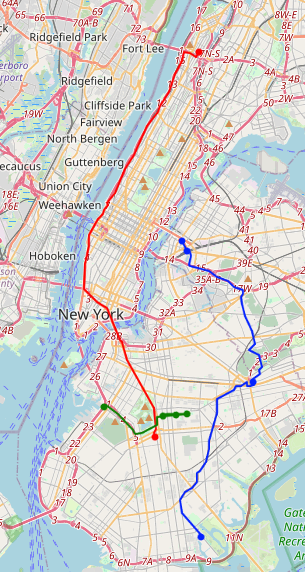
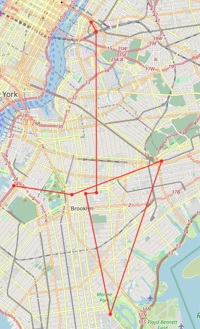
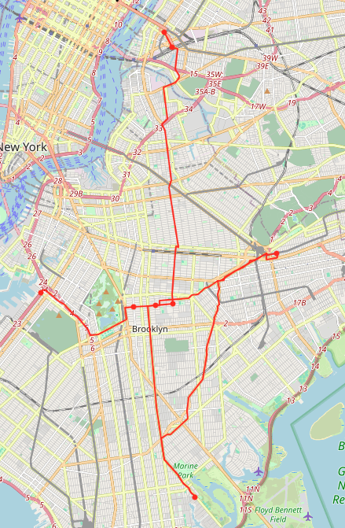
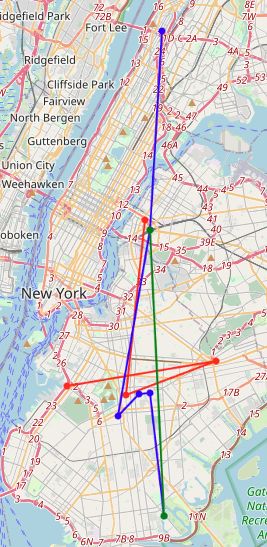

# multi-objective-mod
Moiblity-on-demand system for multiple vehicles.

### Objective
Board as many passengers as possible, satisfying constraints.

### Constraints
1. There are N vehicles.
2. A location must be visited only once.
3. There is no depot (It can start from anywhere and arrive anywhere).
4. There is a working time for each deliver.
5. There is a capacity of vehicles.
6. A penalty is given for the number of locations that cannot be visited.

### Requirements
```bash
sudo apt update
sudo apt install pybind11-dev
pip install gurobipy==10.0.3
```

### My own python modules
It is for using my route planning algorithm (``planner.cpp``) in Python3. pybind11 is a header library faciliating seamless C++ and Python interoperability with minimal code, making it straightforward to expose C++ functions and classes to Python.

### Compile
```bash
c++ -O3 -Wall -shared -std=c++11 -fPIC $(python3 -m pybind11 --includes) astar.h astar.cpp planner.cpp -o planner.so
```

### Run demo code
If you want to get the optimal cost,
```python
python3 main.py -v ${number_of_vehicles} -w ${alpha} ${beta} ${gamma} -pudo ${user_id_1} ${pickup_location_1} ${dropoff_location_1} -pudo ${user_id_2} ${pickup_location_2} ${dropoff_location_2} -c ${capacity} -p ${penalty} -t ${time_limit}
```
#### Example 1
```python
python3 main.py -v 3 -w 0 1 0 -pudo 50 47 52 -pudo 60 244 642 -pudo 70 508 1572 -pudo 80 60 342 -pudo 90 440 1014 -c 10 -p 0 -t 3600
```
- Delivery calls

| user ID | pickup location | dropoff location |
|:-------:|:---------------:|:----------------:|
|   50    |       47        |        52        |
|   60    |       244       |       642        |
|   70    |       508       |       1572       |
|   80    |       60        |       342        |
|   90    |       440       |       1014       |

- Result

| car |              route              | users  | capacity | travel time (seconds) |
|:---:|:-------------------------------:|:------:|:--------:|:---------------------:|
|  0  |          508&rarr;1572          |   70   |    1     |        2113.92        |
|  1  | 244&rarr;440&rarr;642&rarr;1014 | 60, 90 |    2     |        1874.46        |
|  2  |   60&rarr;47&rarr;52&rarr;342   | 50, 80 |    2     |        663.35         |

There are no unserviced users.
<p align="center">
 
</p>
The left is sequences of locations and the right is detailed paths.

#### Example 2
```python
python3 main.py -v 1 -w 0 1 0 -pudo 50 47 52 -pudo 60 244 642 -pudo 70 508 1572 -pudo 80 60 342 -pudo 90 440 1014 -pudo 100 1014 440 -c 10 -p 0 -t 3600
```
- Delivery calls

| user ID | pickup location | dropoff location |
|:-------:|:---------------:|:----------------:|
|   50    |       47        |        52        |
|   60    |       244       |       642        |
|   70    |       508       |       1572       |
|   80    |       60        |       342        |
|   90    |       440       |       1014       |
|   100   |      1014       |       440        |

- Result

| car |                              route                               |     users      | capacity | travel time (seconds) |
|:---:|:----------------------------------------------------------------:|:--------------:|:--------:|:---------------------:|
|  0  | 224&rarr;440&rarr;47&rarr;52&rarr;1014&rarr;642&rarr;60&rarr;342 | 50, 70, 80, 90 |    4     |        3527.67        |

Unserviced users are 60, 100.

<p align="center">
 
</p>
The left is sequences of locations and the right is detailed paths.

#### Example 3
```python
python3 main.py -v 3 -w 0 1 0 -pudo 50 47 52 -pudo 60 244 642 -pudo 70 508 1572 -pudo 80 60 342 -pudo 90 440 1014 -pudo 100 1014 440 -c 10 -p 0 -t 3600
```
- Delivery calls

| user ID | pickup location | dropoff location |
|:-------:|:---------------:|:----------------:|
|   50    |       47        |        52        |
|   60    |       244       |       642        |
|   70    |       508       |       1572       |
|   80    |       60        |       342        |
|   90    |       440       |       1014       |
|   100   |      1014       |       440        |

- Result

| car |                      route                       |    users    | capacity | travel time (seconds) |
|:---:|:------------------------------------------------:|:-----------:|:--------:|:---------------------:|
|  0  |          224&rarr;60&rarr;642&rarr;342           |   60, 80    |    2     |        2316.05        |
|  1  | 1014&rarr;47&rarr;52&rarr;508&rarr;440&rarr;1572 | 50, 70, 100 |    3     |        3146.77        |
|  2  |                  440&rarr;1014                   |     90      |    1     |        1542.97        |

There are no unserviced users.

<p align="center">
 
</p>
The left is sequences of locations and the right is detailed paths.